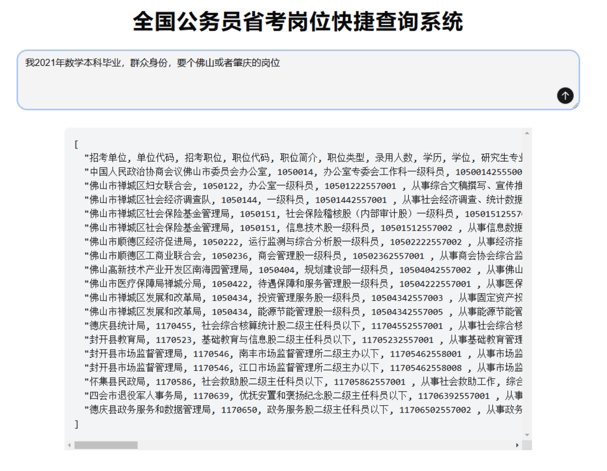

# AI 公务员岗位筛选器

我们的公务员考试很多岗位都有限制，官方给的查询系统太垃圾了，很多搜索做不了。

举个例子，我本科学的是数学，适合什么岗位？

你是不是第一反应就去官网岗位查找器里面搜数学？ 

错了！有的岗位是不限制专业的，你搜数学的话，这部分岗位是不会显示的。

你可能说：搜两次不就行了？ 一次搜数学一次搜不限。

又错了！有的岗位限制是“理学”，它是包含数学的，但你直接搜数学的话是搜不出来这些岗位的。

## 为什么要 AI

逐字匹配太容易出错了，而且说不定他哪些字段里面给你搞个空格或者逗号错误，比如 `数、学` 那就彻底没法搞了。

唯一的出路：让 AI 去阅读每一条岗位描述，每条岗位给出 `对 or 错`，这样考生只需要口头描述一下就可以搜了。

## 技术路线

### 前端：

Next.js

Tailwind CSS

Shadcn UI

### 后端:

Go

并发查询

DeepSeek API

### DevOps：

阿里云

函数计算

Docker 自定义容器部署

## 部署方法

在 `frontend` 目录 `pnpm install && pnpm dev`

在 `backend` 目录 `go run index.go`

在 `backend/.env` 填写好数据库相关的密码等信息