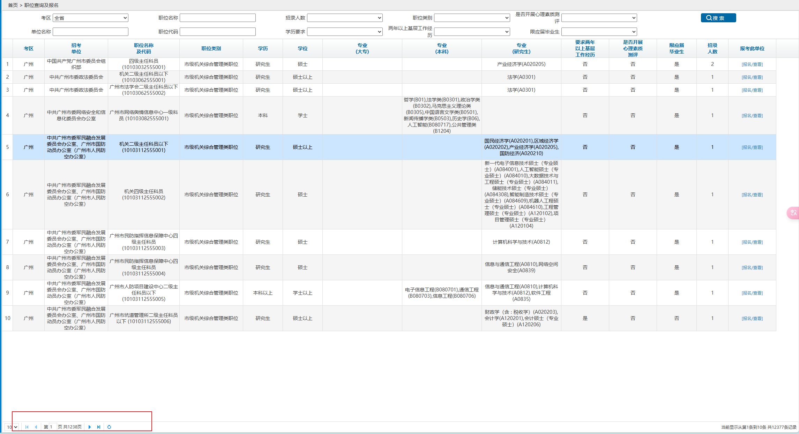

# 公务员岗位筛选器

省考报名考试界面过于简陋，有超过1万个岗位，条件筛选功能过于简陋，无法完成个性化的筛选。




比方说这种查询 

```txt
我是计算机系的，只有本科学位，基层工作经历， 不是应届生，不是党员， 服务基层项目人员和退役大学生士兵不符合我
```

就难以在那个界面上实现。

本系统接入人工智能，你只要像上面这样口头描述一下，就能筛选出符合你条件的岗位。

## 使用方法
``` bash
git clone http://github.com/washingtonbase/government-job-viewer
pip install openai
cd government-job-viewer
```

1.修改 `index.py` 的185行 `user_prompt = 你的条件`

2.修改第9行的 api_key，换成你自己的 deepseek 秘钥

3.执行 `python index.py`， 结果就出来了，存储在 results 文件夹